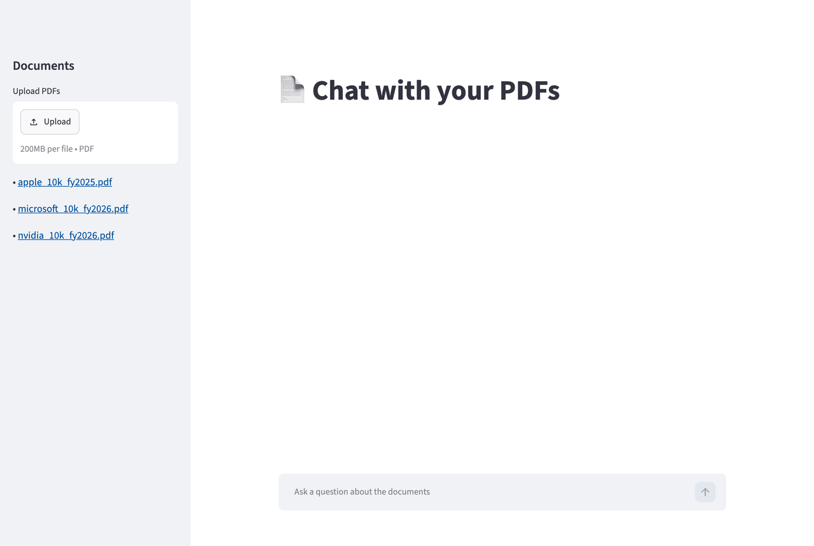
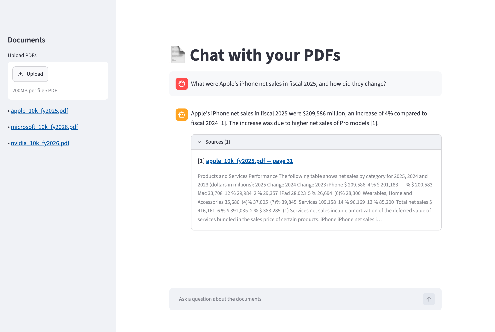
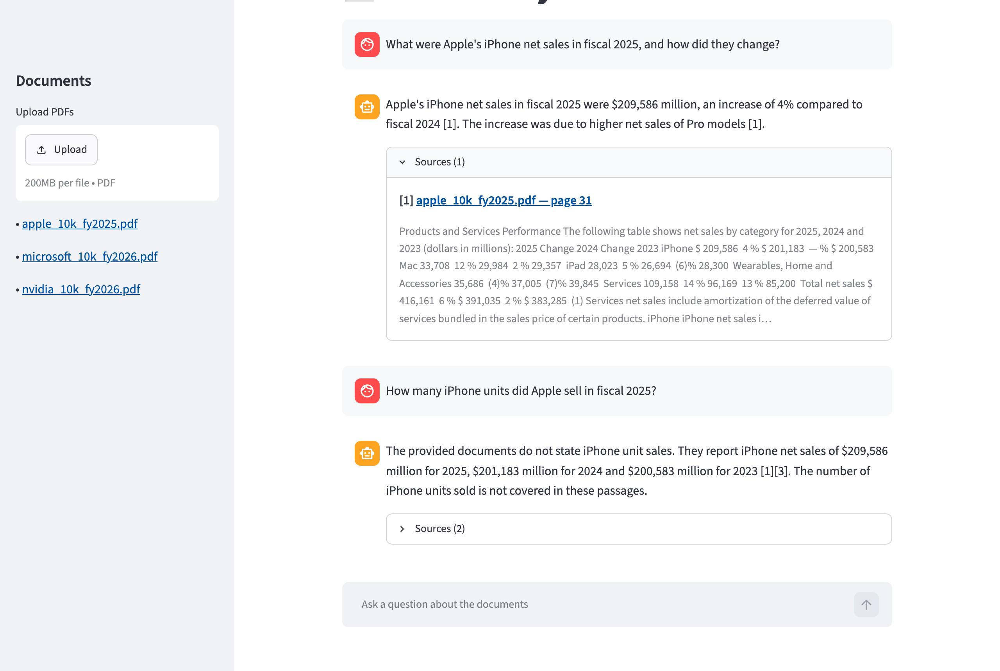

# PDF RAG Chat — Showcase

A chatbot that answers questions **only from your PDFs**, with every answer cited to the **file and page** it came from.
If the documents don't contain the answer, it says so instead of guessing.

> This repo is a showcase (screenshots + behaviour). The source code is private and available on request / as part of a project.



## What it does

- Upload a handful of PDFs (policies, manuals, contracts, reports)
- Ask questions in plain language
- Get concise answers with `[n]` citations → expand to see **file, page and the exact passage**
- Out-of-scope questions are refused, not hallucinated
- Partly answerable questions: answers the covered part, states what's missing
- Broken files are rejected; scanned PDFs without a text layer are flagged as not searchable

## Real example outputs

Sample corpus: 3 fictional company documents (employee handbook, travel policy, product manual).

| Question | Answer | Cited source |
|---|---|---|
| How many days of PTO can I carry over, and when do they expire? | Up to 5 unused days may be carried over into the next calendar year [1]. Carried-over days expire on March 31 [1]. | `acme_employee_handbook.pdf`, p.2 |
| How do I factory reset the X200, and is water damage covered? | Hold power + volume-down for 12 seconds until the LED blinks orange three times [2]. Water damage is not covered by the 2-year limited warranty [1]. | `widgetpro_x200_manual.pdf`, p.2 + p.3 |
| What is the international per diem, and who is the CEO? | The daily meal allowance for international travel is USD 100 [1]. The documents don't contain information about the CEO. | `acme_travel_policy.pdf`, p.2 |
| What is the capital of France? | I couldn't find the answer in the provided documents. | — (correct refusal) |

## Screenshots

| Chat with citations | Refusal on out-of-scope question |
|---|---|
|  |  |

## How it works

```
Ingest:  PDFs ─▶ text per page ─▶ chunks (page number kept) ─▶ embeddings ─▶ vector index

Chat:    question ─▶ top-k chunks ─▶ grounded prompt ─▶ LLM
                   ─▶ answer with [n] markers ─▶ only cited passages returned as sources
                   ─▶ no valid citation? → treated as ungrounded → refusal
```

**Stack:** Python · FastAPI · LangChain · FAISS · OpenAI API (or any OpenAI-compatible model, e.g. DeepSeek; local embeddings via Ollama) · Streamlit

**Engineering:** REST API with OpenAPI docs, pinned dependencies, offline unit tests (fake LLM + fake embeddings), config via `.env`.

## Extensible to

Qdrant / Pinecone / Supabase Vector · Next.js frontend · OCR for scanned PDFs · Slack / web-widget delivery · multi-turn conversation · hybrid search + reranking + retrieval evals
(see also: [healthcare-agentic-rag](https://github.com/PatrickSun93/healthcare-agentic-rag) — hybrid retrieval, reranking, LangGraph agent, eval harness)

## Contact

Available for RAG / document-AI projects — reach out via my freelance profile.
